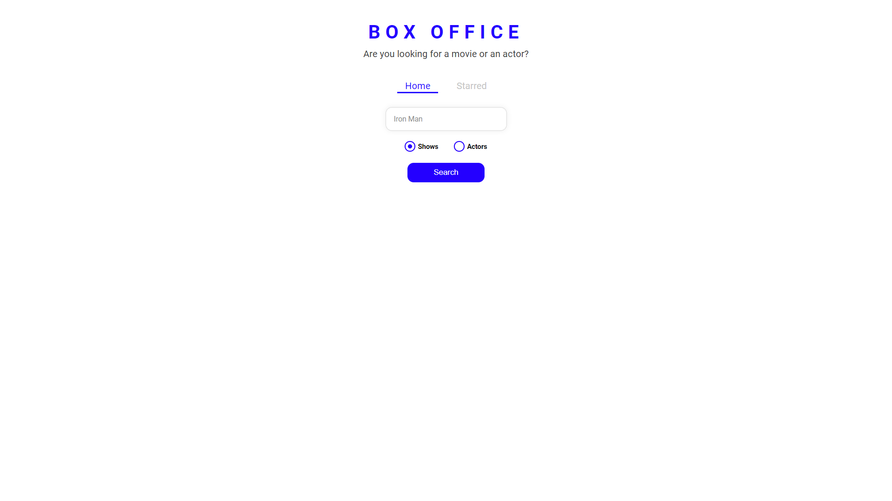
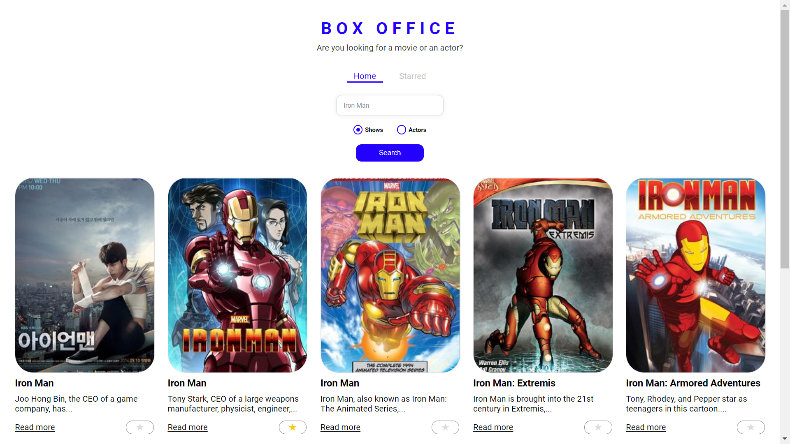
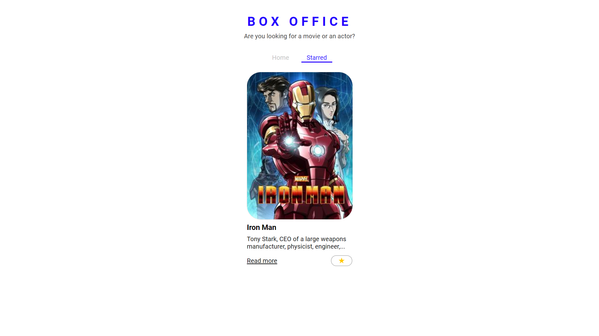
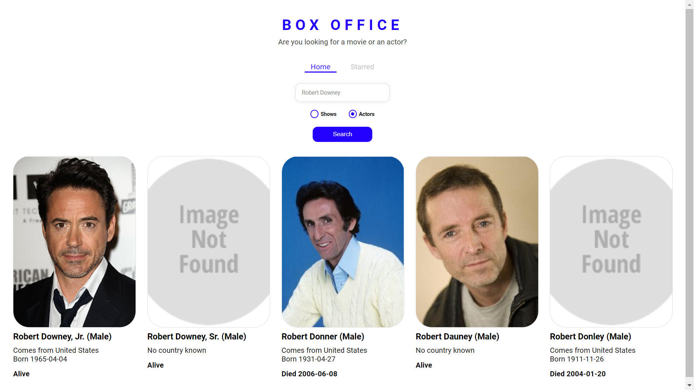

# Box office

### Screenshots
 - Home Page 
<kbd></kbd> 
 - Searched Shows Page 
<kbd></kbd> 
 - Starred Page 
<kbd></kbd> 
 - Searched Actor Page 
<kbd></kbd> 

## Overview

A movie search app that consumes an external API to display data.

Stack:

- React
- Styles with Styled Components

## Develop locally

1. Clone this repo by running `git clone https://github.com/swagatobag2000/box-office.git`
2. Install dependencies by running `npm install`
3. Run `npm run start`

## Deployment

Deployed to github pages:

1. Open `package.json` and change homepage from `"https://swagatobag2000.github.io/box-office"` to
   `"https://YOUR_USERNAME.github.io/REPOSITORY_NAME"`

2. Run `npm run deploy`
